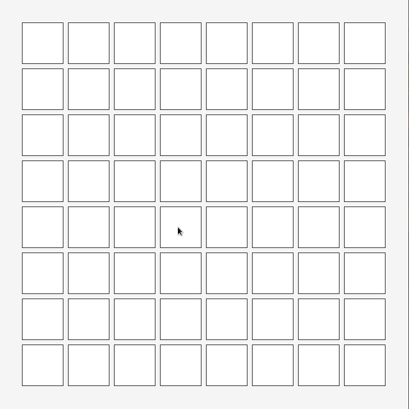

# caga - In progress trivia memory game written in C

In progress trivia memory game written in C using [Raylib 4.0](www.raylib.com)



## How to build:

- Requires `CMake`, `GNU make` and some flavour of `C` compiler.

**NOTE:** Tested on Arch Linux 5.19.X

```console
git clone --recursive https://github.com/mscode98/caga.git
cd caga
mkdir build
cmake ..
make
./caga
```